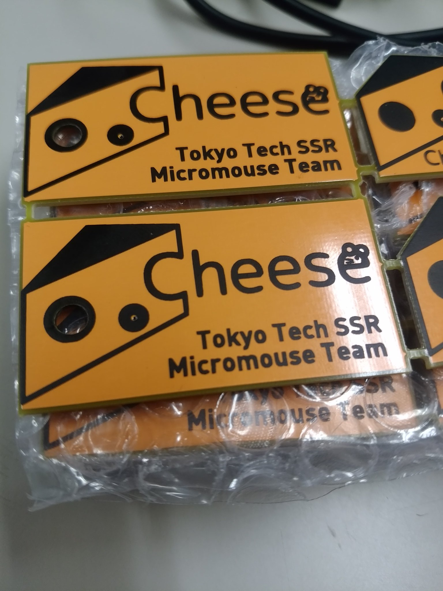

# Cheeseキーホルダー
Cheeseキーホルダーのkicad project.
# Schematic(回路図)
ベタGNDでデコレーションするためにGND viaが一個打たれてる.
# Image(写真)

# File and Directory(ファイル構造)
### logo_silk/
Cheeseのシルクデータが入ってる.
### gerber/
ガーバーデータとElecrowへの発注データが入ってる. 基板製造会社に発注しよう!
### CheeseHolder.dxf
基板外形のDXFファイル.
